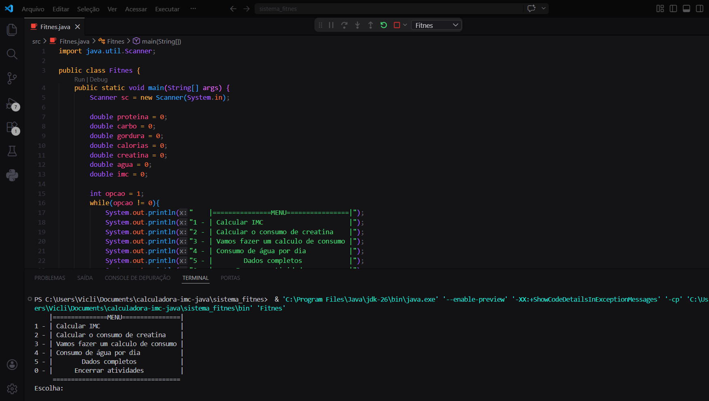

# 🏋️ Fitnes - Assistente de Saúde no Terminal


Aplicação desenvolvida em **Java** que funciona como um assistente interativo de saúde, nutrição e desempenho físico diretamente no terminal.

O sistema permite calcular métricas corporais essenciais e acompanhar dados importantes durante a execução, ajudando o usuário a tomar decisões mais conscientes sobre seu corpo e sua alimentação.

---

## 🚀 Sobre o projeto

Este projeto vai além de uma simples calculadora.

Ele foi pensado como um **sistema interativo**, onde o usuário navega por menus e realiza diferentes cálculos relacionados à saúde, com os dados sendo armazenados durante a execução para gerar um **resumo completo no final**.

---

## 📸 Exemplo de execução



---

## 🎯 Funcionalidades

### 📊 Avaliação corporal
- Cálculo de IMC  
- Classificação automática:
  - Abaixo do peso  
  - Peso normal  
  - Sobrepeso  

---

### 💊 Suplementação
- Cálculo da dose diária de creatina baseado no peso corporal  

---

### 🍗 Nutrição (macronutrientes)

#### Proteína
- Consumo saudável  
- Foco em hipertrofia  
- Nível atleta  

#### Gordura
- Cálculo ideal baseado no peso  

#### Carboidrato
- Cálculo inteligente com base nas calorias diárias  

---

### 🔥 Gasto calórico
Estimativa de calorias diárias baseada em:
- Peso  
- Altura  
- Idade  
- Nível de atividade física  

---

### 💧 Hidratação
- Cálculo da ingestão ideal de água por dia  

---

### 📋 Resumo completo
O sistema armazena os dados durante o uso e exibe:

- Proteína  
- Carboidrato  
- Gordura  
- Calorias  
- Creatina  
- Água  
- IMC  

---

## 🖥️ Interface

```
|===============MENU================|
1 - Calcular IMC
2 - Calcular o consumo de creatina
3 - Vamos fazer um calculo de consumo
4 - Consumo de água por dia
5 - Dados completos
0 - Encerrar atividades
```

---

## ⚙️ Tecnologias utilizadas

- Java  
- Scanner (entrada de dados via terminal)  

---

## ▶️ Como executar

### 1. Clone o repositório
```bash
git clone https://github.com/SEU-USUARIO/fitness-calculator-java.git
```

### 2. Acesse a pasta
```bash
cd fitness-calculator-java
```

### 3. Compile o projeto
```bash
javac Fitnes.java
```

### 4. Execute o programa
```bash
java Fitnes
```

---

## 🎓 Objetivo do projeto

Este projeto foi desenvolvido com foco em:

- Estruturas de repetição (`while`)  
- Estruturas condicionais (`if/else`)  
- Lógica de programação aplicada a problemas reais  
- Criação de menus interativos  
- Manipulação de entrada de dados  

---

## 📈 Diferenciais

- Sistema interativo contínuo (menu dinâmico)  
- Armazenamento de dados durante a execução  
- Aplicação prática voltada para saúde e fitness  
- Organização lógica crescente  

---

## 🚀 Evoluções futuras

- Refatoração em métodos (clean code)  
- Interface gráfica (JavaFX ou Swing)  
- API com Spring Boot  
- Banco de dados  
- Versão web  

---

## 💡 Possível aplicação real

Este sistema pode evoluir para:

- Aplicação mobile de acompanhamento físico  
- Sistema web com login de usuários  
- Integração com academias ou personal trainers  

---

## 👨‍💻 Autor

Victor Omena

---

## 💡 Observação

Este projeto faz parte da minha evolução como desenvolvedor backend, com foco em **Java e lógica aplicada a problemas reais**.
